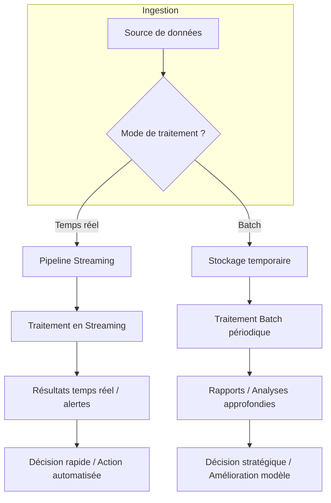

# Concepts de Data Streaming, Traitement en Temps Réel et Traitement Différé (Batch)

## 1. Introduction aux modalités de traitement des données

Dans l’univers du Big Data, le traitement des données s’organise principalement autour de deux paradigmes : le traitement **en temps réel** (streaming) et le traitement **différé** (batch). Le choix entre ces approches dépend des objectifs métier, de la nature des données, de leurs volumes, et des contraintes techniques.

---

## 2. Data Streaming : traitement continu et temps réel

### Définition

Le **data streaming** consiste à collecter et traiter les données dès leur production, de manière continue, avec une latence minimale. Ce flux constant de données, appelé stream, permet des analyses en quasi-temps réel, favorisant des prises de décisions rapides.

### Caractéristiques

- Ingestion constante et rapide de données (capteurs IoT, logs, réseaux sociaux)
- Traitement à faible latence (de l’ordre de la seconde ou milliseconde)
- Généralement utilisé pour détection d’anomalies, tableaux de bord en direct, personnalisation instantanée

### Exemples d’usage

- **Sécurité informatique** : détection d’intrusions en analysant en temps réel les flux réseaux.
- **Transport urbain** : ajustement dynamique des feux de signalisation en fonction du trafic détecté par capteurs.
- **Finance** : décision automatique sur les ordres boursiers avec analyse des fluctuations minutieuses du marché.

---

## 3. Traitement différé (batch) : analyse sur données accumulées

### Définition

Le traitement batch agit sur des ensembles de données stockées sur une période donnée. Les données sont collectées dans un volume suffisant puis traitées en bloc. Cette approche est adaptée à des traitements complexes, longs et non urgents.

### Caractéristiques

- Traitement de gros volumes à la fois
- Latence plus élevée (minutes, heures, voire jours)
- Convient pour rapports, analyses historiques, entraînement de modèles ML sur datasets complets

### Exemples d’usage

- **Rapports mensuels de vente** : calcul consolidé des chiffres de plusieurs millions de transactions.
- **Analyse marketing** : segmentation client basée sur plusieurs mois de données comportementales.
- **Génération de recommandations** : entraînement hors ligne des modèles de Machine Learning.

---

## 4. Comparaison des deux approches

| Critère              | Data Streaming (Temps réel)           | Traitement Batch (Différé)                    |
|----------------------|-------------------------------------|----------------------------------------------|
| Latence              | Très faible (millisecondes / secondes) | Plus élevée (minutes à jours)                 |
| Volumes traités      | Flux continus, souvent petits segments | Gros volumes accumulés                         |
| Complexité calcul    | Souvent calculs simples et rapides   | Calculs complexes et agrégés                   |
| Utilisation typique  | Monitoring, alerting, personnalisation | Reporting, analyses approfondies, ML training |

---

## 5. Schéma Mermaid illustrant le workflow des deux traitements

---

## 6. Cas d’usage hybride et architecture Lambda

Les architectures modernes combinent souvent les deux approches dans ce qu’on appelle une **architecture Lambda**. Elle intègre :

- Un pipeline batch pour le traitement complet et la génération de modèles fiables.
- Un pipeline streaming pour l’analyse temps réel et l’adaptation immédiate.

Cela permet d’avoir à la fois une vision complète et des réponses instantanées.

---

## 7. Sources utilisées

- Confluent, *Streaming vs Batch Processing: Key Differences & Use Cases*, 2024. [source](https://www.confluent.io/streaming-vs-batch-processing/)
- Apache, *What is Batch Processing?* and *What is Stream Processing?*, 2023. [source](https://www.apache.org/databases/databases.html)
- IBM Cloud Learn Hub, *Batch vs Real-Time Streaming Data Processing*, 2023. [source](https://www.ibm.com/cloud/learn/batch-processing-vs-streaming-processing)
- Databricks, *Introduction to Batch vs Streaming Data*, 2024. [source](https://databricks.com/glossary/batch-processing)

---

Le choix entre streaming et batch dépend donc du besoin métier : réactivité immédiate vs traitements exhaustifs et complexes. L’intégration conjointe dans des architectures hybrides permet de couvrir un spectre large d’exigences analytiques et opérationnelles.