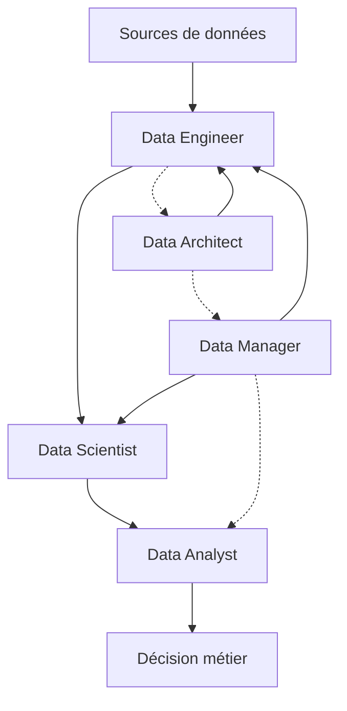

# Interactions et collaborations entre les métiers du Big Data dans le cycle des données

## 1. Introduction : un écosystème interconnecté

Le cycle de vie des données dans une organisation implique une chaîne de métiers complémentaires. Chaque profil apporte son expertise spécifique et travaille en interaction étroite avec les autres pour assurer une gestion optimale et une exploitation pertinente des données.

---

## 2. Le cycle des données et les interactions métiers

Le cycle de vie des données comprend plusieurs étapes : collecte, ingestion, stockage, préparation, analyse, modélisation, visualisation, exploitation et gouvernance. Chaque étape mobilise plusieurs métiers du Big Data qui collaborent pour transformer les données brutes en valeur concrète.

### Étape 1 : Collecte et ingestion des données

- **Data Engineer** : Conçoit et met en place les pipelines de collecte, assurant la qualité technique (stockage, formats).
- **Data Architect** : Définit les standards architecturaux et veille à la scalabilité des systèmes.

### Étape 2 : Stockage et préparation

- **Data Engineer** : Nettoie, transforme et organise les données pour consommation.
- **Data Architect** : Gère la structure du data lake, bases de données et leur évolution.
- **Data Manager** : Supervise la qualité des données et les règles de conformité.

### Étape 3 : Analyse et modélisation

- **Data Scientist** : Utilise les données préparées pour entraîner des modèles prédictifs ou descriptifs.
- **Data Analyst** : Réalise des analyses exploratoires, crée dashboards et rapports.

### Étape 4 : Exploitation et décision

- **Data Analyst** : Communique les insights aux équipes métiers pour décision opérationnelle.
- **Data Manager** : S’assure du respect des politiques d’accès et de confidentialité.
- **Data Architect** & **Data Engineer** : Optimisent les systèmes selon les usages observés.

---

## 3. Illustration Mermaid des flux d’interactions

Points clés :

- Les Data Engineers sont pivots dans la transformation et la transmission des données.
- Data Architects définissent le cadre technique et garantissent la cohérence.
- Le Data Manager impose la gouvernance et la qualité transversale.
- Data Scientists et Data Analysts collaborent pour générer et restituer de la valeur.

---

## 4. Exemple concret d’une collaboration réussie

Dans une entreprise d’énergie renouvelable :

- Les **Data Engineers** intègrent en continu les données des capteurs solaires et éoliens.
- Le **Data Architect** conçoit un data lake hybride sur cloud pour stocker et traiter ces données à grande échelle.
- Le **Data Manager** veille à l’anonymisation des données sensibles et à leur conformité aux réglementations.
- Le **Data Scientist** conçoit un modèle de prédiction de la production énergétique.
- Le **Data Analyst** fournit des dashboards interactifs aux gestionnaires d’infrastructures.
- Grâce à cette collaboration, l’entreprise optimise efficacement sa production en fonction des prévisions.

---

## 5. Enjeux et facilitation de la collaboration

- **Communication** : utilisation d’outils collaboratifs, documentations partagées.
- **Standards et gouvernance** : politiques claires construites par le Data Manager.
- **Formation croisée** : compréhension mutuelle des contraintes métiers et techniques.
- **Automatisation** des pipelines et reporting pour fluidifier les échanges.

---

## 6. Sources utilisées

- Databricks, *Data Roles and Collaboration: Building Effective Big Data Teams*, 2024. [source](https://databricks.com/blog/data-roles-and-collaboration)
- IBM, *How Teams Work Together in Data Projects*, 2023. [source](https://www.ibm.com/topics/data-team-collaboration)
- Forbes Technology Council, *The Importance of Data Team Collaboration*, 2023. [source](https://www.forbes.com/sites/forbestechcouncil/2023/10/12/the-importance-of-data-team-collaboration/)
- Snowflake, *Understanding Data Team Roles and Responsibilities*, 2024. [source](https://www.snowflake.com/guides/data-team-roles)

---

Les interactions entre Data Engineer, Data Architect, Data Manager, Data Scientist et Data Analyst doivent être orchestrées pour transformer de manière fluide la donnée en avantage business. La réussite d’un projet Big Data dépend autant de l’expertise individuelle que de la qualité de la collaboration.