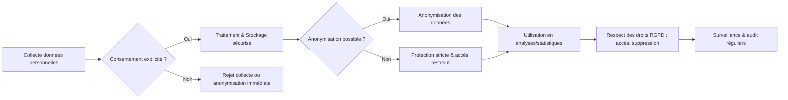

# Principes de confidentialité et importance de l'anonymisation des données

## 1. Introduction : la protection des données personnelles au cœur des enjeux actuels

La collecte et la manipulation des données personnelles sont encadrées par des réglementations strictes visant à protéger la vie privée des individus. Deux principes fondamentaux gouvernent cet encadrement : la confidentialité des données et l’anonymisation. Respecter ces principes permet de réduire les risques liés à la divulgation et à la mauvaise utilisation des données.

---

## 2. Principes de confidentialité des données

### 2.1 Définitions clés

- **Donnée personnelle** : toute information se rapportant à une personne physique identifiée ou identifiable (ex. nom, adresse IP, caractéristiques biométriques).
- **Confidentialité** : garantir que les données ne sont accessibles qu'aux personnes autorisées et protégées contre toute divulgation non désirée.

### 2.2 Cadre réglementaire

- **RGPD (Règlement Général sur la Protection des Données)** en Europe : impose des règles claires sur la collecte, le traitement, le consentement, la sécurité et les droits des personnes.
- Exemples d’exigences RGPD :
  - Consentement explicite pour la collecte des données.
  - Droits d’accès, de rectification et de suppression.
  - Obligation d’informer en cas de violation de données.
  
- **CCPA (California Consumer Privacy Act)** : texte américain inspiré du RGPD mais avec des spécificités locales.

### 2.3 Implications en Big Data

Les volumes de données massifs recueillis abolissent souvent les frontières traditionnelles de la protection, ce qui renforce la nécessité de garantir la confidentialité dès la conception des systèmes (Privacy by Design).

---

## 3. Importance et méthodes d’anonymisation

### 3.1 Pourquoi anonymiser ?

- Permet d’utiliser les données à des fins analytiques ou statistiques sans compromettre la vie privée.
- Réduit la responsabilité juridique.
- Facilite la conformité réglementaire en limitant le risque d’identification des individus.

### 3.2 Techniques courantes d’anonymisation

| Technique           | Description                                    | Usage typique                          |
|---------------------|------------------------------------------------|--------------------------------------|
| Suppression         | Elimination des identifiants directs           | Bases de données de contact          |
| Masquage            | Remplacement partiel des données sensibles     | Rapports internes                    |
| Pseudonymisation    | Remplacement par un identifiant alternatif     | Etudes longitudinales                 |
| Agrégation          | Regroupement des données par catégories        | Statistiques démographiques           |
| Perturbation        | Ajout de bruit statistique dans les données    | Recherche médicale                    |

### 3.3 Limites et risques

- **Ré-identification** : quand des données anonymisées peuvent être croisées avec d’autres sources pour identifier un individu.
- Nécessité de mesurer le niveau de risque et d’adopter des stratégies robustes.

---

## 4. Illustration Mermaid : Schéma de gestion des données personnelles

---

## 5. Exemples concrets

- **Santé** : utilisation de données patients anonymisées pour la recherche médicale permet d’éviter la divulgation d’informations sensibles.
- **Marketing digital** : base de cookies pseudonymisés pour personnaliser les offres sans révéler l’identité réelle des utilisateurs.
- **Smart cities** : collecte de données de mobilité agrégées pour optimiser les transports publics sans tracer les individus.

---

## 6. Sources utilisées

- CNIL, *La protection des données personnelles*, 2024. [source](https://www.cnil.fr/fr/definition/donnees-personnelles)
- Commission Européenne, *EU GDPR Overview*, 2023. [source](https://ec.europa.eu/info/law/law-topic/data-protection_en)
- IAPP, *Anonymization Techniques and their Limits*, 2023. [source](https://iapp.org/news/a/anonymization-techniques-explained/)
- OWASP, *Data Protection and Privacy Principles*, 2023. [source](https://owasp.org/www-project-top-ten/)

---

Confidentialité et anonymisation sont des piliers pour gérer les données personnelles avec respect et conformité. Ils assurent la confiance des utilisateurs tout en permettant aux organisations d’exploiter les données à des fins innovantes et responsables.