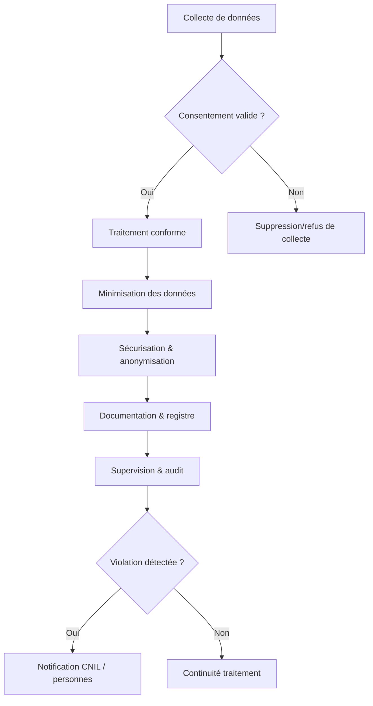

# Présentation et implications du RGPD pour la collecte et le traitement des données personnelles

## 1. Qu’est-ce que le RGPD ?

Le **Règlement Général sur la Protection des Données (RGPD)** est une réglementation européenne entrée en vigueur le 25 mai 2018. Il encadre le traitement des données à caractère personnel afin de renforcer la protection de la vie privée des citoyens de l’Union européenne.

Le RGPD s’applique à toute organisation, qu’elle soit européenne ou non, dès lors qu’elle collecte ou traite des données personnelles de résidents de l’UE.

---

## 2. Principes fondamentaux du RGPD

Le RGPD repose sur plusieurs principes clés qui doivent être intégrés dès la conception des systèmes de collecte et traitement des données :

| Principe            | Description                                             |
|---------------------|---------------------------------------------------------|
| Licéité, loyauté et transparence | Collecte avec consentement clair ou fondement légal, information transparente des personnes concernées |
| Limitation des finalités    | Données collectées uniquement pour des finalités précises et légitimes |
| Minimisation des données    | Collecter uniquement les données nécessaires au traitement |
| Exactitude                 | Maintenir les données à jour et exactes |
| Limitation de la conservation | Ne pas conserver les données plus longtemps que nécessaire |
| Intégrité et confidentialité | Assurer sécurité et confidentialité des données contre les risques (perte, divulgation) |
| Responsabilité (accountability) | Obligations de prouver la conformité du traitement |

---

## 3. Droits des personnes concernées

Le RGPD accorde des droits renforcés aux individus sur leurs données :

- **Droit d’accès** : connaître les données collectées et leur traitement.
- **Droit de rectification** : corriger les données inexactes.
- **Droit à l’effacement** («droit à l’oubli») : suppression des données sous conditions.
- **Droit à la limitation du traitement**.
- **Droit à la portabilité** : recevoir les données dans un format structuré.
- **Droit d’opposition** : refuser certains traitements, notamment marketing.
- **Droit de ne pas faire l’objet de décisions automatisées** sans intervention humaine significative.

---

## 4. Obligations des organisations

### 4.1 Consentement explicite

Le consentement doit être libre, spécifique, éclairé et univoque. Il ne peut être déduit d’actions passives.

### 4.2 Registre des traitements

Les entreprises doivent documenter tous les traitements réalisés.

### 4.3 Analyse d'impact relative à la protection des données (DPIA)

Nécessaire pour les traitements susceptibles de présenter un risque élevé.

### 4.4 Sécurité des données

Mise en place de mesures techniques et organisationnelles adaptées pour protéger les données.

### 4.5 Notification en cas de violation de données

Obligation d’informer la CNIL et les personnes concernées sous 72 heures en cas de faille compromettant les données.

---

## 5. Implications concrètes dans le Big Data

- **Difficulté de minimiser les données** : le Big Data s’appuie sur des volumes importants et variés, rendant la minimisation complexe.
- **Anonymisation et pseudonymisation privilégiées** pour limiter les risques.
- **Consentement granulaire et gestion des accès** indispensables.
- **Documentation rigoureuse** des flux de données et traitements.
- **Formation des équipes** pour garantir la conformité dans chaque étape du pipeline data.

---

## 6. Exemple d’application

Une start-up développant une application mobile collecte les données de localisation :

- Elle informe clairement les utilisateurs,
- Obtient un consentement explicite avant activation,
- Anonymise les données pour analyse géographique,
- Met en œuvre un registre des traitements,
- Notifie toute faille rapidement à l’autorité de contrôle.

---

## 7. Schéma Mermaid : cycle de conformité RGPD dans le traitement des données

---

## 8. Sources utilisées

- CNIL, *Le RGPD (Règlement Général sur la Protection des Données)*, 2024. [source](https://www.cnil.fr/fr/reglement-europeen-protection-donnees)
- Commission Européenne, *EU Data Protection Rules*, 2023. [source](https://ec.europa.eu/info/law/law-topic/data-protection_en)
- IAPP, *Understanding GDPR Compliance for Big Data*, 2023. [source](https://iapp.org/news/a/big-data-and-gdpr-compliance/)
- Deloitte, *GDPR and Big Data: Striking the right balance*, 2023. [source](https://www2.deloitte.com/insights/us/en/topics/risk/gdpr-big-data.html)

---

Le RGPD impose un cadre rigoureux qui transforme la manière dont les données sont collectées, traitées, et sécurisées. Sa prise en compte dans les projets Big Data impose d’équilibrer exploitation et protection, garantissant ainsi des traitements respectueux des droits individuels.