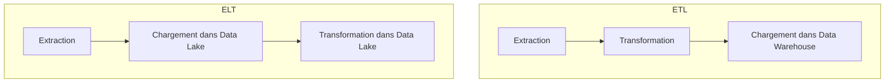

# Différences entre ETL et ELT dans les architectures Big Data

## 1. Introduction

Dans le contexte des architectures Big Data, les processus de transformation des données sont cruciaux. Deux méthodes majeures dominent : **ETL** (Extract, Transform, Load) et **ELT** (Extract, Load, Transform). Comprendre leurs différences et leurs applications permet d’optimiser la conception des pipelines et la gestion des données.

---

## 2. Définition et séquence des étapes

### 2.1 ETL : Extract, Transform, Load

- **Extraction** des données depuis diverses sources (bases relationnelles, fichiers, API).
- **Transformation** réalisée avant le chargement : nettoyage, filtrage, agrégation.
- **Chargement** des données transformées dans l’entrepôt (data warehouse).

Cette méthode privilégie un environnement centralisé pour le traitement avant insertion.

### 2.2 ELT : Extract, Load, Transform

- **Extraction** des données comme dans ETL.
- **Chargement** immédiat dans un système de stockage (souvent un data lake ou entrepôt cloud).
- **Transformation** des données au sein même du système de stockage, généralement via la puissance de calcul native (SQL sur data lake, moteurs Spark, etc.).

ELT est adapté aux architectures modernes, notamment dans le cloud.

---

## 3. Comparaison pratique

| Critère            | ETL                             | ELT                              |
|--------------------|--------------------------------|---------------------------------|
| Ordre des opérations | Transformation avant chargement | Chargement avant transformation |
| Endroit de traitement | Serveur dédié ETL ou middleware | Système de stockage/data lake   |
| Performance         | Limité par la capacité de l'outil ETL | Exploite la scalabilité du stockage |
| Types de données    | Structurées principalement      | Structurées, semi-structurées, non structurées |
| Flexibilité         | Moins flexible, fixes          | Plus flexible et évolutif       |
| Latence             | Souvent plus élevé              | Adapté à traitement near-real-time |

---

## 4. Cas d’usage et exemples

### ETL

Une entreprise bancaire utilise ETL pour alimenter son data warehouse relationnel avec des données structurées issues de systèmes transactionnels. La transformation en amont garantit des données nettoyées et conformes avant chargement.

### ELT

Un site e-commerce stocke tous ses logs, données clients et réseaux sociaux bruts dans un data lake sur le cloud (ex : Amazon S3). La transformation (nettoyage, enrichissement) est réalisée dans le cluster Spark qui exploite directement ces données pour des analyses avancées.

---

## 5. Illustration Mermaid : workflows ETL vs ELT

---

## 6. Limites et évolutions

- ETL peut être limité pour de très gros volumes ou données non structurées.
- ELT nécessite des infrastructures capables de supporter la puissance de calcul sur stockage distribué.
- Les architectures hybrides combinant ETL et ELT émergeant selon les besoins.

---

## 7. Sources utilisées

- Talend, *ETL vs ELT: What's the Difference?*, 2024. [source](https://www.talend.com/resources/etl-vs-elt/)
- Informatica, *ETL vs ELT: Comparative Review*, 2023. [source](https://www.informatica.com/resources/articles/etl-vs-elt.html)
- AWS, *Data Lakes and ETL/ELT in the Cloud*, 2024. [source](https://aws.amazon.com/big-data/datalakes-and-analytics/)
- Databricks, *Modern Data Pipeline Architectures*, 2023. [source](https://databricks.com/blog/2023/05/01/modern-data-pipelines-elt-vs-etl.html)

---

Comprendre ETL et ELT, leurs forces et contraintes, est fondamental pour choisir l’approche adaptée à son écosystème Big Data et maximiser l’efficacité des traitements de données.