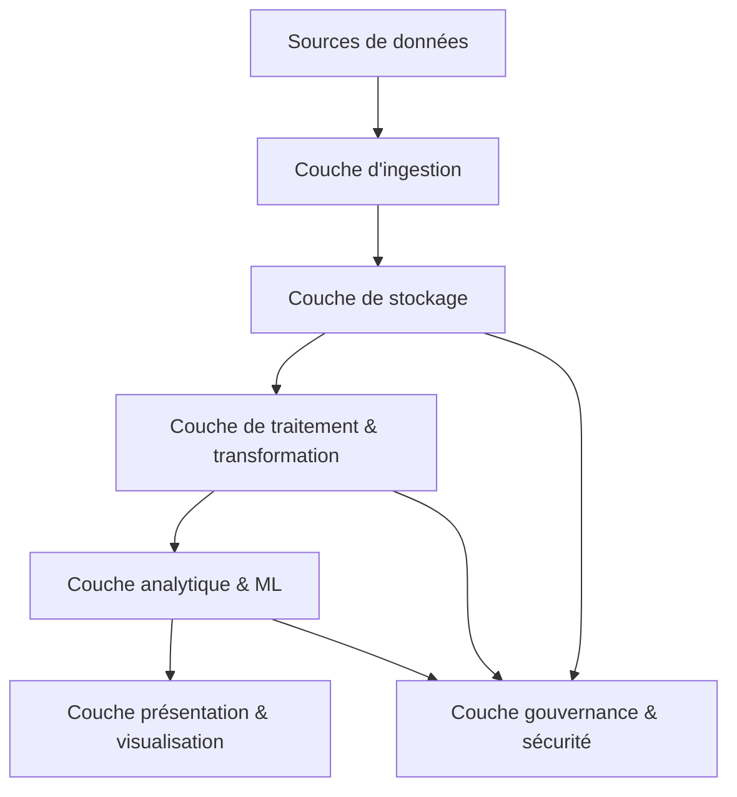

# Principales couches et composants des architectures Big Data

## 1. Introduction : Une architecture multi-couches pour gérer la complexité

Les architectures Big Data sont conçues pour traiter, stocker et analyser d'énormes volumes de données hétérogènes en provenance de sources diverses. Ces architectures s’appuient sur plusieurs couches fonctionnelles qui facilitent la scalabilité, la flexibilité, et l’efficacité des traitements.

---

## 2. Les principales couches d’une architecture Big Data

### 2.1 Couche d'ingestion (Data Ingestion Layer)

- Responsable de la collecte et de l’agrégation des données provenant de sources hétérogènes (logs, capteurs IoT, bases de données, réseaux sociaux).
- Prise en charge des flux de données batch ou en temps réel.
- Exemples d’outils : Apache Kafka, Apache NiFi, AWS Kinesis.

### 2.2 Couche de stockage (Data Storage Layer)

- Conserve les données sous différentes formes : brutes, transformées, agrégées.
- Utilisation de systèmes distribués et scalables : Data Lakes (Amazon S3, Hadoop HDFS) et Data Warehouses (Snowflake, Google BigQuery).
- Supporte aussi bien les données structurées que semi-structurées ou non structurées.

### 2.3 Couche de traitement et transformation (Data Processing Layer)

- Permet de transformer, nettoyer, enrichir les données (Data Wrangling), ainsi que l’exécution d’analyses.
- Peut fonctionner par batch (Apache Spark, Hadoop MapReduce) ou en streaming (Apache Flink, Spark Streaming).
- Est souvent intégrée aux plateformes cloud pour elasticité et scalabilité.

### 2.4 Couche analytique et Machine Learning (Analytics & ML Layer)

- Exploitation des données traitées pour extraire des insights : analyses descriptives, prédictives, recommandations.
- Plateformes comme Databricks, TensorFlow, MLflow facilitent la construction et déploiement de modèles ML.

### 2.5 Couche de présentation et visualisation (Visualization Layer)

- Interface utilisateur pour explorer les résultats analytiques via dashboards, rapports, alertes.
- Solutions courantes : Tableau, Power BI, Grafana.

### 2.6 Couche de gouvernance et sécurité (Governance & Security Layer)

- Politique de gestion des accès, respect de la confidentialité (RGPD).
- Monitoring, audit, gestion de la qualité des données.
- Outils : Apache Ranger, AWS IAM, Collibra.

---

## 3. Exemple concret d’architecture Big Data pour une entreprise de transport intelligent

- Les capteurs IoT embarqués dans les véhicules envoient des données en temps réel via Kafka (ingestion).
- Ces données sont stockées dans un Data Lake sur Hadoop HDFS.
- Apache Spark traite et nettoyage les données (transformation).
- Les Data Scientists développent des modèles prédictifs pour anticiper la congestion (analyse avancée).
- Les résultats sont consultables via des tableaux de bord Power BI (visualisation).
- La couche sécurité garantit que seules les équipes autorisées ont accès aux données sensibles client.

---

## 4. Diagramme Mermaid : architecture Big Data modulaire

---

## 5. Sources utilisées

- Microsoft Azure, *Big Data architecture overview*, 2024. [source](https://learn.microsoft.com/en-us/azure/architecture/data-guide/big-data/)
- AWS, *Big Data Analytics Architecture*, 2023. [source](https://aws.amazon.com/big-data/datalakes-and-analytics/)
- Cloudera, *Big Data Architecture Components*, 2023. [source](https://www.cloudera.com/resources/big-data-architecture.html)
- Gartner, *Modern Big Data Architecture*, 2023. [source](https://www.gartner.com/en/information-technology/glossary/big-data-architecture)

---

Les architectures Big Data reposent sur des couches distinctes mais complémentaires, qui ensemble assurent la collecte, la gestion, le traitement, l’analyse et la sécurisation des données. Comprendre ces composants facilite la conception et le déploiement d’infrastructures capables de répondre aux défis des données massives et diversifiées.