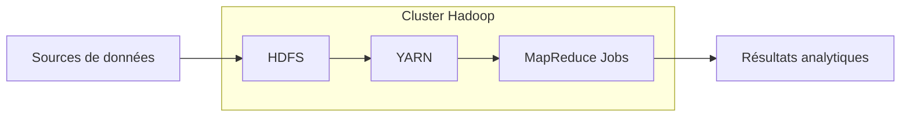

# Présentation détaillée d’une pile technologique avec focus sur Hadoop

## 1. Introduction : Hadoop, fondation des architectures Big Data

Hadoop est une plateforme open source qui a largement contribué à la démocratisation du Big Data. Conçue pour stocker et traiter de très gros volumes de données sur des clusters de serveurs standard, elle forme une pile technologique robuste et évolutive.

---

## 2. Composants clés de la pile Hadoop

### 2.1 Hadoop Distributed File System (HDFS)

- **Rôle** : système de fichiers distribué, conçu pour stocker les données en les répartissant sur plusieurs nœuds.
- **Caractéristiques** : tolérance aux pannes, haute disponibilité, stockage de fichiers très volumineux.
- **Fonctionnement** : fichiers divisés en blocs (par défaut 128 Mo), répliqués pour la résilience.

### 2.2 Yet Another Resource Negotiator (YARN)

- **Rôle** : gestionnaire des ressources de calcul sur le cluster Hadoop.
- **Fonction** : planifie les tâches, distribue les ressources CPU, mémoire, garantit le parallélisme et la scalabilité.

### 2.3 MapReduce

- **Rôle** : framework de traitement distribué pour exécuter les calculs sur les données stockées.
- **Modèle conceptuel** : phase Map (transformation des données) suivie d'une phase Reduce (agrégation des résultats).
- Aujourd’hui MapReduce a été largement remplacé ou complété par Apache Spark pour plus de rapidité et flexibilité.

---

## 3. Écosystème Hadoop complémentaire

De nombreux projets viennent enrichir Hadoop en intégrant fonctionnalités de gestion, requêtage, flux de données, et analyse avancée, par exemple :

| Projet           | Description                              |
|------------------|------------------------------------------|
| Apache Hive      | Système d’entrepôt de données SQL-like, pour requêtes analytiques sur HDFS |
| Apache HBase     | Base de données NoSQL en temps réel basée sur HDFS |
| Apache Pig       | Langage de script pour simplifier la création de programmes MapReduce |
| Apache Oozie     | Orchestrateur de workflows pour automatiser les tâches sur Hadoop |
| Apache Sqoop     | Import/export entre Hadoop et bases relationnelles |
| Apache Flume     | Collecte et transport de données en continu |

---

## 4. Exemple d’utilisation

Une grande entreprise de télécommunications collecte chaque jour téraoctets de logs réseau. Ces données sont stockées sur HDFS. YARN gère les ressources pour exécuter des jobs MapReduce qui traitent ces logs afin d’identifier les incidents et analyser la qualité du service.

---

## 5. Diagramme Mermaid : architecture Hadoop classique

---

## 6. Évolution et contexte actuel

- Hadoop reste une base fiable pour le stockage distribué et le traitement batch.
- L'émergence de nouvelles technologies comme Apache Spark offre un traitement plus rapide et supporte le streaming.
- Les solutions cloud proposent aujourd’hui des services managés intégrant Hadoop ou ses équivalents (ex. AWS EMR, Azure HDInsight).

---

## 7. Sources utilisées

- Apache Hadoop, *Introduction to Hadoop Ecosystem*, 2024. [source](https://hadoop.apache.org/docs/stable/)
- Cloudera, *What is Hadoop?*, 2023. [source](https://www.cloudera.com/about/our-approach/hadoop.html)
- Databricks, *Hadoop vs Spark*, 2023. [source](https://databricks.com/blog/2019/07/23/hadoop-vs-spark.html)
- IBM, *Understanding the Hadoop Ecosystem*, 2023. [source](https://www.ibm.com/cloud/learn/hadoop)
- AWS, *Overview of Amazon EMR*, 2024. [source](https://aws.amazon.com/emr/)

---

Comprendre la pile technologique Hadoop, ses composants et son écosystème est fondamental pour concevoir des architectures Big Data capables de stocker de vastes volumes de données et d’exécuter des traitements distribués à grande échelle.