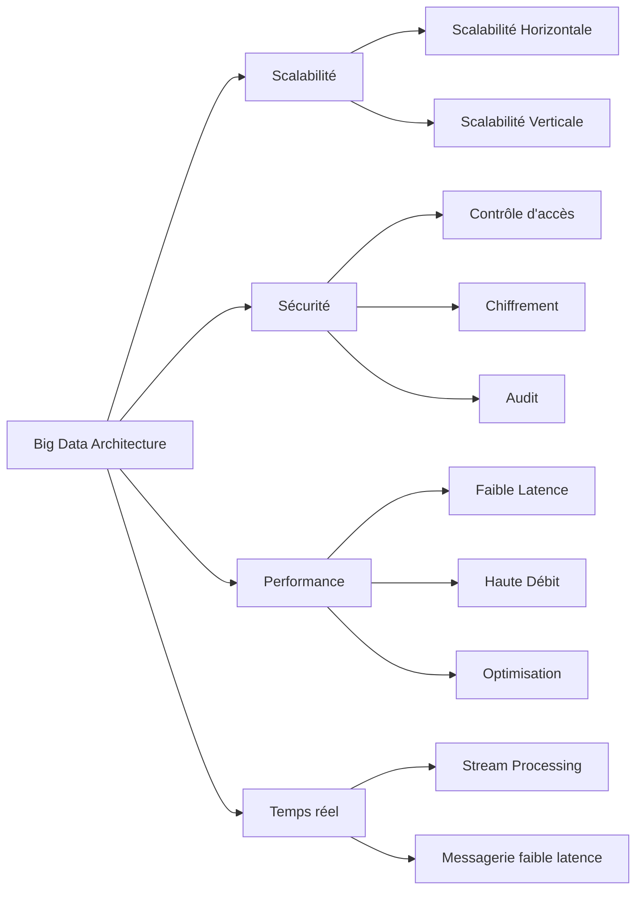

# Exigences non fonctionnelles dans les architectures Big Data : scalabilité, sécurité, performance, traitement en temps réel

## 1. Introduction

Les architectures Big Data doivent répondre à des exigences non fonctionnelles spécifiques pour garantir leur efficacité, leur robustesse et leur pertinence opérationnelle. Ces exigences concernent notamment la scalabilité, la sécurité, la performance et la capacité à traiter les données en temps réel.

---

## 2. Scalabilité : capacité à gérer la croissance des données

### Définition

La scalabilité (extensibilité) est la capacité d’un système Big Data à absorber l’augmentation du volume de données, du nombre d’utilisateurs ou des requêtes sans dégradation des performances.

### Types de scalabilité

- **Scalabilité horizontale** : ajout de serveurs ou nœuds au cluster.
- **Scalabilité verticale** : augmentation des ressources (CPU, RAM) sur les machines existantes.

### Application

Les architectures Big Data s’appuient majoritairement sur la scalabilité horizontale via des clusters distribués (ex : Hadoop, Spark). Cela permet de traiter des pétaoctets en répartissant la charge.

---

## 3. Sécurité : protection des données sensibles

### Aspects clés

- **Contrôle d’accès** : authentification, gestion fine des permissions (rôles, groupes).
- **Chiffrement** : des données au repos (stockage) et en transit (réseaux).
- **Audit et traçabilité** : logs des accès et modifications pour conformité réglementaire.
- **Protection contre les menaces** : prévention des intrusions, malware, accès non autorisé.

### Exemples d’outils

- Apache Ranger pour la gouvernance des accès.
- Kerberos pour l’authentification dans Hadoop.
- Solutions cloud intégrées (AWS IAM, Azure AD).

---

## 4. Performance : traitement efficace et temps de réponse adapté

### Critères

- Latence faible pour les requêtes interactives.
- Débit élevé pour le traitement de gros volumes.
- Optimisation du stockage et des requêtes.

### Approches

- Mise en cache distribuée (Apache Ignite, Redis).
- Indexation intelligente (Apache Solr, Elasticsearch).
- Architecture en mémoire (Spark).

---

## 5. Traitement en temps réel : prise de décision immédiate

### Définition

Capacité à ingérer, traiter et analyser les données quasi instantanément pour réagir rapidement.

### Techniques et outils

- **Stream processing** : Apache Kafka Streams, Apache Flink, Spark Streaming.
- Systèmes de messagerie à faible latence (Kafka, RabbitMQ).

### Cas d’usage

- Détection de fraude en temps réel dans les transactions bancaires.
- Surveillance continue des équipements industriels via IoT.
- Personnalisation dynamique de recommandations e-commerce.

---

## 6. Illustration Mermaid : résumé des exigences non fonctionnelles

---

## 7. Sources utilisées

- Databricks, *Big Data Non-Functional Requirements*, 2024. [source](https://databricks.com/glossary/big-data-non-functional-requirements)
- Gartner, *Best Practices in Big Data Security*, 2023. [source](https://www.gartner.com/en/documents/3987635/best-practices-in-big-data-security)
- Confluent, *Real-Time Big Data Processing*, 2023. [source](https://www.confluent.io/blog/real-time-big-data-processing/)
- Microsoft Azure, *Big Data Performance Tuning*, 2024. [source](https://learn.microsoft.com/en-us/azure/architecture/data-guide/big-data/performance)

---

La prise en compte rigoureuse des exigences non fonctionnelles telles que la scalabilité, la sécurité, la performance et le traitement en temps réel est essentielle pour concevoir des architectures Big Data efficaces, capables de répondre aux besoins opérationnels et stratégiques des organisations.