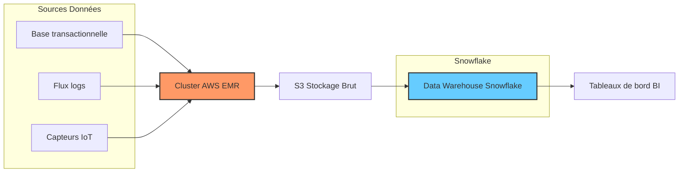

# Déploiement IaaS et PaaS avec services fournisseurs : AWS EMR, Azure HDInsight, Snowflake, Cloudera

## 1. Introduction

Le déploiement d’architectures Big Data repose souvent sur des offres cloud modulaires, soit en mode **IaaS (Infrastructure as a Service)**, soit en **PaaS (Platform as a Service)**. De nombreux fournisseurs majeurs proposent des services managés adaptés aux traitements Big Data, facilitant la mise en production, la scalabilité et la maintenance. Nous examinons ici quatre solutions largement utilisées : **AWS EMR**, **Azure HDInsight**, **Snowflake**, et **Cloudera**.

---

## 2. AWS EMR (Elastic MapReduce)

### Description

EMR est un service managé d’Amazon qui permet de déployer des clusters Hadoop, Spark, Hive, Presto, etc., sur des instances EC2 en mode IaaS avec orchestration automatisée.

### Points forts

- Rapidité de déploiement et scalabilité automatique.
- Intégration native avec l’écosystème AWS : S3, IAM, CloudWatch.
- Adapté aux traitements batch, interactifs et analyses en temps réel.
- Tarification à la minute basée sur l’usage.

### Exemple d’usage

Une société de média analyse en temps réel millions d’événements utilisateur en agrégeant les données sur un cluster EMR scalable.

---

## 3. Azure HDInsight

### Description

HDInsight est une plateforme PaaS entièrement managée par Microsoft, permettant de déployer rapidement des clusters Hadoop, Spark, Kafka, Hive, etc., dans Azure.

### Points forts

- Facilité d’intégration avec Azure Data Lake Storage, Azure Synapse et Power BI.
- Sécurité avancée via Azure Active Directory et chiffrement.
- Interface de gestion simple et automatisation via Azure CLI.
- Support des charges batch et streaming.

### Exemple d’usage

Une entreprise finance utilise HDInsight pour traiter des données transactionnelles et générer des rapports analytiques avec Power BI.

---

## 4. Snowflake

### Description

Snowflake est une plateforme cloud native de gestion et d’analyse de données, fonctionnant sur AWS, Azure et GCP, sous forme de Data Warehouse SaaS (Software as a Service).

### Points forts

- Architecture multi-cluster partageant le stockage et le calcul.
- Séparation complète entre stockage et compute pour ajuster indépendamment la scalabilité.
- Support des données structurées et semi-structurées (JSON, Avro, Parquet).
- Simplification du data sharing et collaboration inter-entreprises.

### Exemple d’usage

Une société e-commerce regroupe ses données clients et ventes dans Snowflake pour alimenter ses dashboards marketing en temps quasi réel.

---

## 5. Cloudera Data Platform (CDP)

### Description

Cloudera est une plateforme Big Data hybride, mêlant IaaS et PaaS, permettant d’exécuter Hadoop, Spark, et d’autres workloads sur site ou cloud. CDP offre des services managés et intégrés multi-cloud.

### Points forts

- Support hybride facilitant les migrations et intégrations.
- Gouvernance centrale via Cloudera Data Catalog.
- Sécurité renforcée et conformité avec les normes industrielles.
- Large écosystème compatible avec les workloads analytiques complexes.

### Exemple d’usage

Une entreprise industrielle combine données IoT on-premise et cloud dans CDP pour optimiser ses processus de maintenance prédictive.

---

## 6. Comparaison synthétique

| Solution      | Type       | Plateformes Cloud   | Usage ciblé                    | Points forts clés                  |
|---------------|------------|--------------------|-------------------------------|----------------------------------|
| AWS EMR       | IaaS/PaaS  | AWS                | Big Data processing (batch/stream) | Intégration AWS, scalabilité auto |
| Azure HDInsight | PaaS      | Azure              | Big Data & streaming          | Intégration Azure, sécurité       |
| Snowflake     | SaaS/Data Warehouse | AWS/Azure/GCP    | Data Warehouse & Analytics    | Indépendance stockage/compute, collaboration |
| Cloudera CDP  | Hybride    | Multi-cloud + on-premise | Big Data hybride & ML         | Gouvernance, flexibilité hybride  |

---

## 7. Exemple d’architecture combinée avec AWS EMR et Snowflake

---

## 8. Sources utilisées

- AWS, *Amazon EMR*, 2024. [source](https://aws.amazon.com/emr/)
- Microsoft Azure, *Azure HDInsight*, 2023. [source](https://azure.microsoft.com/services/hdinsight/)
- Snowflake, *Cloud Data Platform*, 2024. [source](https://www.snowflake.com/product/)
- Cloudera, *Cloudera Data Platform*, 2023. [source](https://www.cloudera.com/products/cloudera-data-platform.html)

---

Choisir entre ces services dépend des contraintes techniques, du degré d’autonomie souhaité, des besoins d’intégration, et des préférences d’écosystème cloud. Les offres managées permettent de se concentrer sur la valeur métier tout en bénéficiant de flexibilité et scalabilité quasi-infinies.