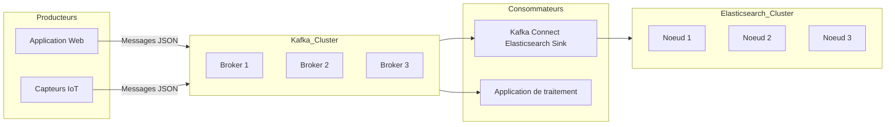

# Implémentation d’un pipeline Big Data avec Kafka pour l’ingestion et Elasticsearch pour le stockage et la recherche

## 1. Introduction

Mettre en place un pipeline Big Data performant passe par la maîtrise des solutions d’ingestion et de stockage capables de traiter de forts volumes de données en temps quasi réel. Une architecture couramment utilisée combine **Apache Kafka** pour la collecte et le transport des données, et **Elasticsearch** pour leur indexation, stockage optimisé et recherche rapide.

---

## 2. Apache Kafka : moteur d’ingestion et de diffusion

### Rôle

Kafka est une plateforme distribuée de streaming conçue pour gérer des flux de données massifs, assurant la durabilité, l’ordre et la répartition des messages.

### Fonctionnement

- Données publiées dans des **topics** partitionnés.
- Producteurs (producers) envoient les messages.
- Consommateurs (consumers) lisent ces messages pour traitement.
- Haute tolérance via réplication et journal immuable.

### Avantages clés

- Scalabilité horizontale.
- Faible latence en ingestion.
- Résilience et récupération des messages.
- Écosystème riche (Kafka Connect, Kafka Streams).

---

## 3. Elasticsearch : moteur de stockage et recherche

### Rôle

Elasticsearch est une base de données distribuée orientée document, conçue pour l’indexation et la recherche textuelle à grande vitesse.

### Fonctionnement

- Les données sont stockées sous forme de documents JSON indexés dans des **indices**.
- Support des requêtes complexes sur texte, dates, champs numériques.
- Réplication et sharding auto pour scalabilité et résilience.

### Avantages clés

- Recherche très rapide, opérations analytiques et agrégations.
- Intégration native avec Kibana pour visualisation.
- API REST simple et riche.

---

## 4. Architecture d’un pipeline Kafka → Elasticsearch

---

## 5. Étapes pratiques de mise en place

### a) Configuration des producteurs Kafka

- Connexion au cluster Kafka.
- Sérialisation JSON des événements.
- Publication dans des topics dédiés selon la nature des données.

### b) Déploiement d’un Kafka Connect avec un Sink Elasticsearch

- Utiliser le connecteur officiel Elasticsearch Sink Connector.
- Configurer le connecteur pour correspondre aux topics Kafka et aux indices Elasticsearch.
- Gestion des schémas et mappings via le connecteur.

### c) Indexation et recherche dans Elasticsearch

- Définition des mappings (types de champs et analyzers).
- Requêtes REST pour recherches scalables et agrégations.
- Utilisation de Kibana pour exploration visuelle.

---

## 6. Exemple d’application

Dans une plateforme de surveillance des logs applicatifs :

- Les logs sont produits par les instances d’applications vers Kafka.
- Kafka Connect transmet automatiquement ces logs vers Elasticsearch.
- Les équipes ops interrogent Elasticsearch via Kibana pour détecter en temps réel pannes ou anomalies.

---

## 7. Sources et références

- Apache Kafka, *Documentation officielle*, 2024. [source](https://kafka.apache.org/documentation/)
- Elasticsearch, *Guide d’indexation et recherche*, 2024. [source](https://www.elastic.co/guide/en/elasticsearch/reference/current/index.html)
- Confluent, *Kafka Connect Elasticsearch Sink connector*, 2023. [source](https://docs.confluent.io/kafka-connect-elasticsearch/current/overview.html)
- Elastic, *Kibana for Log Analytics*, 2023. [source](https://www.elastic.co/kibana)

---

L’association Kafka-Elasticsearch constitue un socle robuste, scalable et flexible pour construire des pipelines d’ingestion et d’analyses rapides et interactives. Ce modèle est particulièrement adapté aux environnements nécessitant un traitement quasi instantané de flux massifs, avec des exigences fortes de recherche et d’exploration.